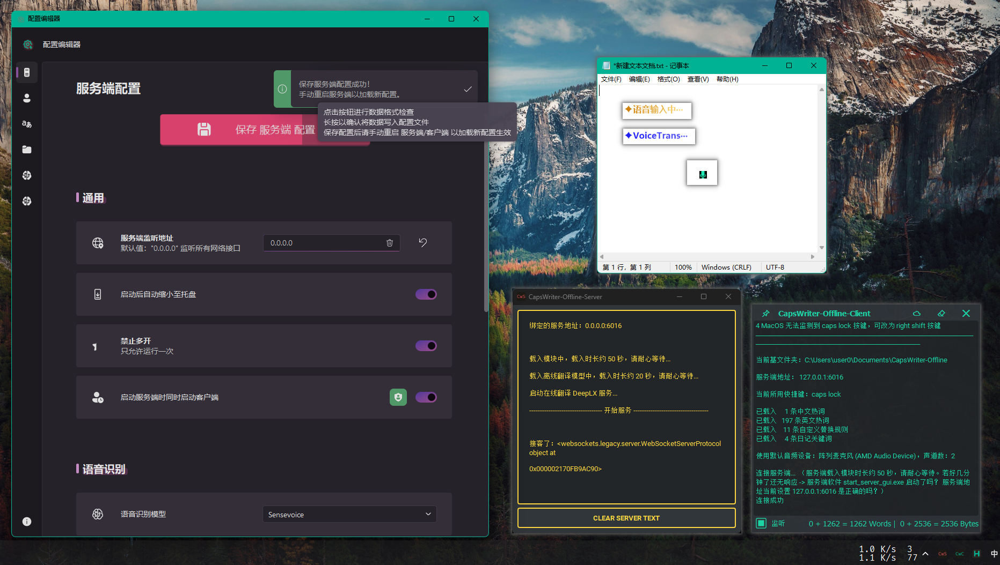
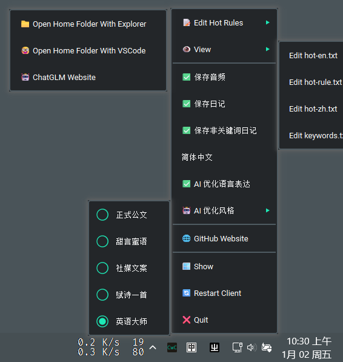
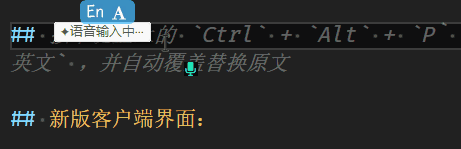
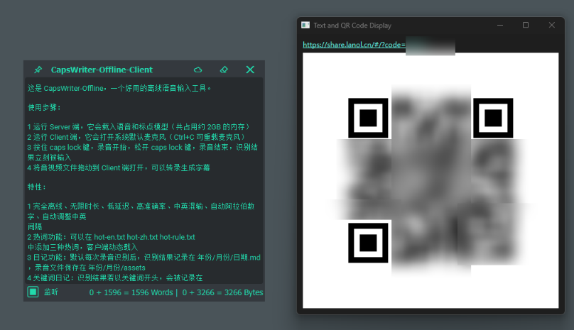
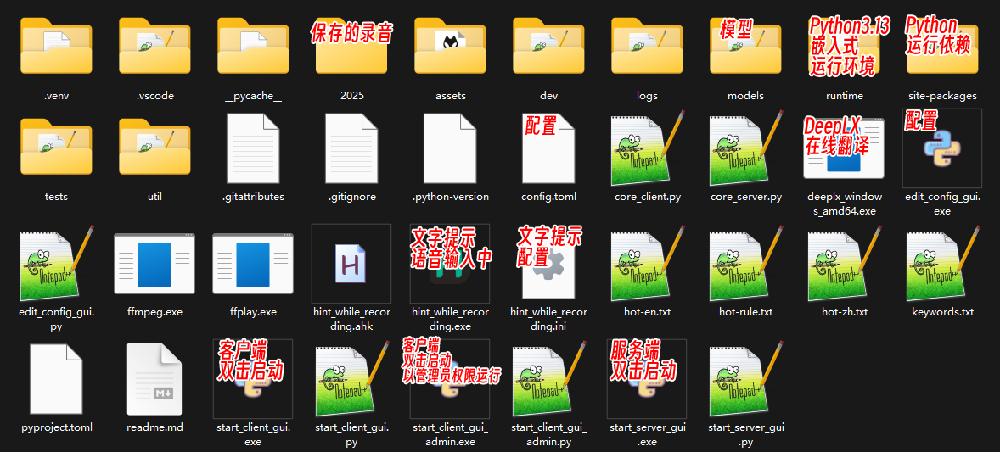
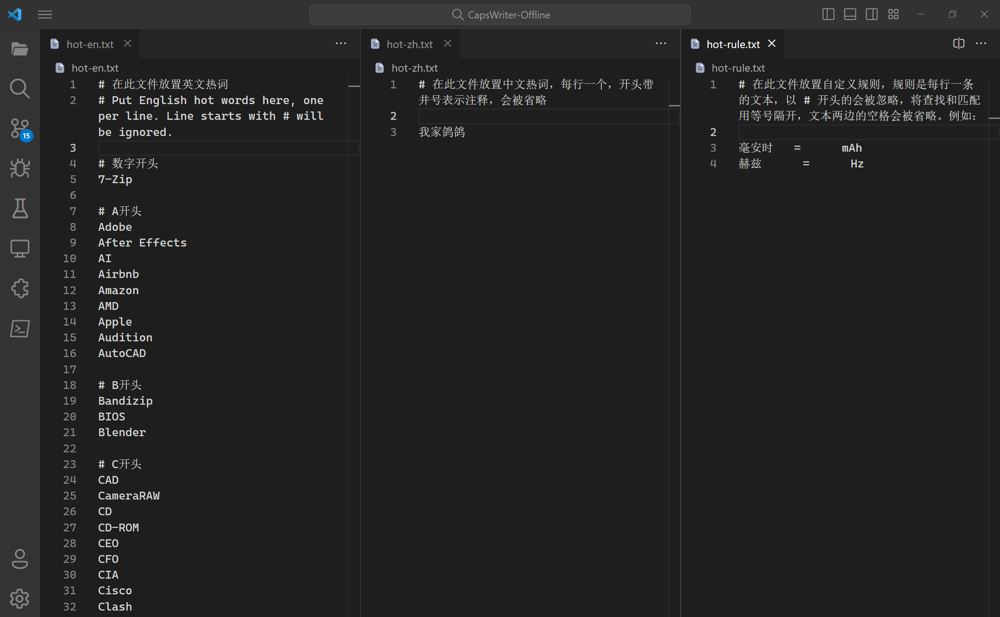
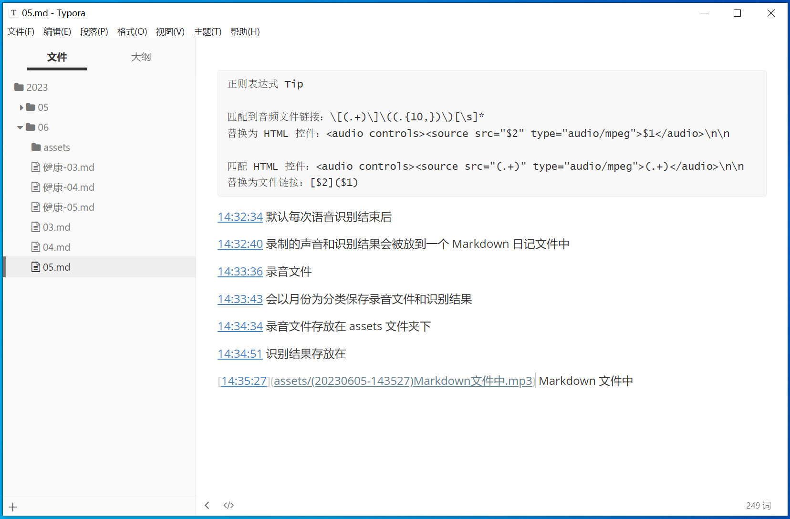

# 😘 CapsWriter-Offline 图形界面包分支 （ 仅  <span style="color: #4ABAFF;">[Windows 10+](https://www.microsoft.com/zh-cn/windows) </span> ）



#  <span style="color: #4ABAFF;">[Windows](https://www.microsoft.com/zh-cn/windows)</span> 端离线语音输入简/繁体、中译英、字幕转录；在线多译多、云剪贴板等等 （选用SenseVoice模型时 支持中粤英日韩多语种）

> [!IMPORTANT]
> 新增图形化配置界面 `edit_config_gui.exe`，可方便修改配置，但仍支持手动修改 `config.toml` 文件

## 😎 八个功能：

1. 按下键盘上的大写锁定键 `CapsLock` ，录音开始，当松开大写锁定键时，就会识别你的录音，并将识别结果立刻输入
2. 按下键盘上的 `Left Shift` 再按 `CapsLock` 可以将识别结果离线翻译为英文，当松开大写锁定键时，将翻译结果立刻输入
3. 按下键盘上的 `Right Shift` 再按 `CapsLock` 可以将识别结果在线翻译（[LibreTranslate](https://github.com/LibreTranslate/LibreTranslate) / [DeepLX](https://github.com/OwO-Network/DeepLX)）为多国语言，默认设置翻译为日文，当松开大写锁定键时，将翻译结果立刻输入
4. 将音视频文件拖动到客户端 `start_client_gui.exe` 打开，即可转录生成 srt 字幕
5. 按下客户端主界面的  按钮，即可将客户端文本框中内容发布到 [云剪贴板](https://share.lanol.cn) ，并生成获取链接和二维码
6. 快速双击 `CapsLock` ，可语音输入繁体。还可通过托盘图标右键菜单快速切换简/繁体配置
7.  可通过 `edit_config_gui.exe` 图形化配置界面安全地修改客户端/服务端配置，也可手动修改 `config.toml` 文件
8. 可通过客户端托盘菜单 热切换 是否启用 AI 优化语言表达

- [✨ 特性](#-特性)
- [⬇️ 下载地址](#-下载地址)
- [❗ 注意事项](#-注意事项)
- [🤓 源码运行](#-源码运行)
- [🔧 修改配置](#-修改配置)
- [🪳 提交 Bug ](https://github.com/H1DDENADM1N/CapsWriter-Offline/issues)

# 👀 最新更新
## 新版客户端托盘图标右键菜单：

> 

<details>
<summary><h1">展开最近更新</h1></summary>

## 新增 客户端托盘菜单 热切换 AI 优化风格
> 正式公文 / 甜言蜜语 / 社媒文案 / 赋诗一首 / 英语大师

## 新增 可通过客户端托盘菜单 热切换 是否启用 AI 优化语言表达
> 启用后预计增加 5s 时间延长
> 先在 config.toml 中配置 api_key （智谱AI API密钥）
> 获取 API Key https://open.bigmodel.cn/usercenter/proj-mgmt/apikeys


## 新增 客户端托盘菜单 热切换 保存音频 保存日记 保存非关键词日记
> 是否记录非关键词日记内容到 Markdown 文件
> 在 保存日记 save_markdown 启用的情况下有效

## 通过 常用播放器内设置的 播放/暂停快捷键 控制 录音时暂停音频播放
> QQ音乐、网易云音乐、PotPlayer、foobar2000 可通过 edit_config_gui.exe 配置 用于 播放/暂停 的快捷键
> 如果还有其他特殊应用 请配置 config.toml [client.additional_special_apps]
> "<进程名>" = { hotkey = "<对应程序设置的全局快捷键>", name = "<用于输出日志的对应程序名称>" }
> 
> 如果N个特殊应用在播放，支持全部暂停
> 如果一个非特殊应用在播放，通过 媒体键 暂停
> 如果N个非特殊应用在播放，不暂停
> 如果一个特殊应用和N个非特殊应用在播放，只暂停特殊应用
> 
> 默认配置如下：
> | 播放器           | 快捷键          | 备注                               |
> | ---------------- | --------------- | ---------------------------------- |
> | QQ音乐           | Ctrl + Alt + F5 | 需在QQ音乐中设置全局快捷键         |
> | 网易云音乐       | Ctrl + Alt + F6 | 需在网易云音乐中设置全局快捷键     |
> | PotPlayer        | Ctrl + Alt + F7 | 需在PotPlayer中设置全局快捷键      |
> | foobar2000       | Ctrl + Alt + F8 | 需在foobar2000中设置全局快捷键     |
> | VLC Media Player | Ctrl + Alt + F9 | 需在VLC中设置全局快捷键，并重启VLC |
>
> [常用播放器 如何配置 全局播放/暂停 快捷键？](https://github.com/H1DDENADM1N/CapsWriter-Offline/issues/128#issuecomment-3616392251)

## 新增 优先使用 LibreTranslate 在线翻译服务
> 服务端启动时，会自动检查 config.toml 中 LibreTranslate api 地址是否可用
> 如果可用，则优先使用 LibreTranslate 在线翻译服务；
> 如果不可用，则会自动切换到 DeepLX 在线翻译服务

## 新增 可选项 开始和结束任务时播放提示音
> 可在 `config.toml` 设置是否启用，以及音频文件路径和音量。需要ffplay.exe
> ffplay.exe 来自 https://www.gyan.dev/ffmpeg/builds/
> start.mp3 和 stop.mp3 音频文件来自 https://pixabay.com

## 新增 可选项 切换模型 `Sensevoice` 或 `Paraformer`

> Sensevoice模型虽然多了粤英日韩多语种，但是，中文识别效果大不如Paraformer模型
> 比如转录字幕不完整，识别结果不准确、丢失标点等
> 如果你只说中文普通话，建议使用 'Paraformer' 模型
> 不影响简繁转换和翻译

## 新增 可选项 通过注册表/按键判断是否语音输入中

## 新增 可选项 是否启用离在线翻译和状态提示
> start_online_translate_server = True # 启用在线翻译服务
> start_offline_translate_server = True # 启用离线翻译服务
> 
> use_offline_translate_function = True # 启用离线翻译相关快捷键
> use_online_translate_function = True # 启用在线翻译相关快捷键
> 
> hint_while_recording_at_edit_position_powered_by_ahk = True  # 是否启用 基于AHK的 输入光标位置的输入状态提示功能


## 重写hint_while_recording.exe，实现更加精准的输入光标位置提示
不再是监测按键的伪状态，而是由Python(win32gui.PostMessage)将语音输入状态传递给AHK(hwnd)

## 双击`录音键`临时转换 `简/繁` 体中文输出，可在 `config.toml` 设置 `简/繁` 中文作为主要输出 (@JoanthanWu)

## 更美观的“语音输入中”提示，可在 `hint_while_recording.ini` 设置文本内容、颜色、排除列表等 (@JoanthanWu)
> 
> 


## 跟随鼠标光标位置的新版输入状态提示功能可在 `config.toml` 设置禁用

> 

## 新版客户端界面：

> - 透明；极简
> - `Ctrl+鼠标滚轮` 可调整字体大小
> - 标题栏和操作栏失去光标焦点时自动隐藏
> - 窗口贴边自动隐藏
> - 无任务栏图标
>
> 
>
> > 标题栏
> >
> > - 📌：置顶窗口，将它显示在其他窗口之上 / 不置顶
> > - 云贴：按下客户端主界面的 `云贴` 按钮，即可将客户端文本框中的内容发布到[云剪贴板](https://share.lanol.cn)（一个无依赖即用即走的剪切板） ，并生成获取链接和二维码。
> >   
> > - 清空：清空文本框中的全部内容
>
> > 操作栏
> >
> > - 监听：监听客户端输出 / 不监听，仅用作笔记本
> > - 字符数、字节数统计：光标已选中字符数 / 总字符数 | 字节数

</details>

---

# ✨ 特性

1. 基于 [PySide6](https://pypi.org/project/PySide6/) 的 GUI，服务端 `start_server_gui.exe` 默认使用 [Qt-Material](https://github.com/UN-GCPDS/qt-material) dark_yellow 主题，客户端 `start_client_gui.exe` 默认使用 [Qt-Material](https://github.com/UN-GCPDS/qt-material) dark_teal 主题；基于 [PyStand](https://github.com/skywind3000/PyStand) 绿化便携 `exe`
2. 完全离线、无限时长、低延迟、高准确率、中英混输、中译英、自动阿拉伯数字、自动调整中英间隔
3. 防干扰功能：默认录音时静音并暂停其他音频播放，避免音乐干扰语音输入，通过 `config.toml` 中 `mute_other_audio` 和 `pause_other_audio` 配置
4. 离线翻译功能：离线翻译模型[Helsinki-NLP/opus-mt-zh-en](https://huggingface.co/Helsinki-NLP/opus-mt-zh-en) ，组合键 按住 `Left Shift` 再按 `CapsLock` 进行翻译，方便同时需要输入中文和英文翻译的场景。通过 `config.toml` 中 `offline_translate_shortcut` 配置
5. 在线翻译功能：服务端启动时，会自动检查 config.toml 中 [LibreTranslate](https://github.com/LibreTranslate/LibreTranslate) api 地址是否可用，如果可用，则优先使用 LibreTranslate 在线翻译服务；如果不可用，则会自动切换到 DeepLX 在线翻译服务。默认翻译为日文。过于频繁的请求 DeepLX 可能导致 IP 被封。组合键 按住 `Right Shift` 再按 `CapsLock` 进行翻译，方便同时需要输入中文和英文翻译的场景。通过 `config.toml` 中 `online_translate_shortcut` 和 `trans_online_target_languages` 配置
6. 转录功能：将音视频文件拖动到客户端 `start_client_gui.exe` 打开，即可转录生成 srt 字幕
7. 热词功能：可以在 `hot-en.txt hot-zh.txt hot-rule.txt` 中添加三种热词，客户端动态载入
8. 日记功能：默认每次录音识别后，识别结果记录在 `年份/月份/日期.md` ，录音文件保存在 `年份/月份/assets`
9. 关键词日记：识别结果若以关键词开头，会被记录在 `年份/月份/关键词-日期.md`，关键词在 `keywords.txt` 中定义
10. 服务端、客户端分离，可以服务多台客户端
11. 编辑 `config.toml` ，可以配置服务端地址、快捷键、录音开关……
12. 支持最小化到系统托盘
13. 已包含所有 Python 环境和 models 模型，解压即用
14. 输入状态提示功能：按下 `Capslock` 键会在光标处提示 [✦ 语音输入中‧‧‧](https://github.com/HaujetZhao/CapsWriter-Offline/issues/52#issuecomment-1905758203)；按两下 `Capslock` 键（简繁体转换）会在光标处提示✦語音輸入中⇄；按下 `Shift` 和 `Capslock` 键会在光标处提示 [✦VoiceTrans‧‧‧](https://github.com/HaujetZhao/CapsWriter-Offline/issues/52#issuecomment-1905758203)。注意此功能由 [AutoHotKeyV2](https://www.autohotkey.com/download/) `hint_while_recording.exe` 实现，编辑  `hint_while_recording.ini` 修改相关配置
15. 输入状态提示功能 V2：按下 `Capslock` 键会在跟随鼠标指针处提示一个小麦克风图标。默认启用，通过 `config.toml` 中 `hint_while_recording_at_cursor_position` 配置
16. 阿拉伯数字化年份功能：默认将\***\*年 大写汉字替换为阿拉伯数字\*\***年，例如一八四八年 替换为 1848 年。通过 `config.toml` 中 `Arabic_year` 配置
17. 启动后自动缩小至托盘功能：默认 服务端 `start_server_gui.exe` 启动后不显示主窗口，自动缩小至托盘；客户端 `start_client_gui.exe` 显示主窗口。通过 `config.toml` 中 `shrink_automatically_to_tray` 配置
18. 禁止多开功能：默认禁止多开，通过 `config.toml` 中 `only_run_once` 配置
19. 一键启动功能：默认服务端 `start_server_gui.exe` 启动后，自动 **🛡️ 以管理员权限** 启动客户端 `start_client_gui_admin.exe`，通过 `config.toml` 中 `in_the_meantime_start_the_client_and_run_as_admin` 和 `In_the_meantime_start_the_client_as_admin` 配置
20. 将文本上传至云剪切板，方便向 ios 设备分享。基于 https://share.lanol.cn (https://github.com/vastsa/FileCodeBox)，一个无依赖即用即走的剪切板。
21. 默认启用双击`录音键`临时转换 `简/繁` 体中文输出的功能，通过 `config.toml` 中 `enable_double_click_opposite_state` 配置
22. 默认使用简体中文作为主要输出，快速双击输出繁体中文。设置 `config.toml` 中 `convert_to_traditional_chinese_main = '繁'` 可以默认使用繁体中文，双击输出简体中文

# 🪳 无力解决的 Bug

1. 在多屏幕状态，贴边隐藏位置错乱
2. 在多屏幕状态，跟随鼠标光标位置的新版输入状态位置错乱。

# ⬇️ 下载地址

- 123 盘：https://www.123pan.com/s/qBxUVv-H4Zq3.html 提取码:h8vb
- GitHub Release: [Releases · H1DDENADM1N/CapsWriter-Offline](https://github.com/H1DDENADM1N/CapsWriter-Offline/releases)



# ❗ 注意事项

1. 存在杀毒误报，建议关闭杀毒软件和防火墙，再解压
2. 建议先不要修改默认配置，测试能否正常运行
3. 音视频文件转录功能依赖于 `FFmpeg`，打包版本已内置 `FFmpeg`
4. 音频播放依赖于 `FFplay`，打包版本已内置 `FFplay`
5. 默认的快捷键是 `caps lock`，你可以打开 `core_client.py` 进行修改
6. 输入状态提示功能由 [AutoHotKeyV2](https://www.autohotkey.com/download/) `hint_while_recording.exe` 实现，修改 `config.toml` 默认快捷键并**不会**改变提示的按键设置，编辑  `hint_while_recording.ini` 修改相关配置
7. 在线翻译基于 [LibreTranslate](https://github.com/LibreTranslate/LibreTranslate) 或 [DeepLX](https://github.com/OwO-Network/DeepLX)）。服务端启动时，会自动检查 config.toml 中 LibreTranslate api 地址是否可用，如果可用，则优先使用 LibreTranslate 在线翻译服务；如果不可用，则会自动切换到 DeepLX 在线翻译服务。[DeepLX](https://github.com/OwO-Network/DeepLX)过于频繁的请求可能导致 IP 被封，如果出现 429 /502 / 503 错误，则表示你的 IP 被 DeepL 暂时屏蔽了，请不要在短时间内频繁请求
8. 当某程序以管理员权限运行，可能会出现有识别结果但是却无法在那个程序输入文字的状况，例如：`Listary` 、`PixPin` 等。这是因为 `start_client_gui.exe` 默认以用户权限运行客户端，运行在用户权限的程序无法控制管理员权限的程序。你可以关闭用户权限运行的客户端，尝试使用 `start_client_gui_admin.exe` 以管理员权限运行客户端
9. 添加开机自启动的方法：

   9.1 如果你未更改默认配置（ `In_the_meantime_start_the_client = True` 表示一键启动功能 生效，服务端会自动启动客户端），只用新建 `start_server_gui.exe` 的快捷方式，将服务端的快捷方式放到 `shell:startup` 目录下即可在开机时自动启动服务端和客户端。服务端会自动启动客户端。不要添加客户端的快捷方式。

   9.1.1 如果你未更改默认配置（ `In_the_meantime_start_the_client_as_admin = True` ），启动服务端会自动以管理员权限启动客户端。

   9.1.2 如果你更改了默认配置（ `In_the_meantime_start_the_client_as_admin = False` ），启动服务端会自动以用户权限启动客户端。

   9.2 如果你更改了默认配置（ `In_the_meantime_start_the_client = False` 表示一键启动功能 禁用，启动服务端不会启动客户端），新建 `start_server_gui.exe` 的快捷方式，将服务端的快捷方式放到 `shell:startup` 目录下只会在开机时自动启动服务端。客户端不会被启动。

   9.3 如果你更改了默认配置（ `In_the_meantime_start_the_client = False` ），新建 `start_client_gui.exe` 的快捷方式，将客户端的快捷方式放到 `shell:startup` 目录下只会在开机时自动启动客户端。服务端不会被启动。不要再添加客户端 `start_client_gui_admin.exe` 的快捷方式。

   9.4 如果你更改了默认配置（ `In_the_meantime_start_the_client = False` ），新建 `start_client_gui_admin.exe` 的快捷方式，将客户端的快捷方式放到 `shell:startup` 目录下只会在开机时自动以管理员权限启动客户端。服务端不会被启动。不要再添加客户端 `start_client_gui.exe` 的快捷方式。

10. `🤓 Open Home Folder With VSCode ` 使用前需在 `config.toml` 配置 `vscode_exe_path`
11. 输入状态指示位置错乱如何解决？
    10.1 通过 `config.toml` 中 `hint_while_recording_at_cursor_position` 配置禁用跟随鼠标光标位置的麦克风形状的输入状态提示；通过 `config.toml` 中 `hint_while_recording_at_edit_position_powered_by_ahk` 配置禁用输入光标位置的“✦语音输入中‧‧‧”文字状态提示

    10.2 通过重命名或删除 `hint_while_recording.exe` 完全不启用输入光标位置的“✦语音输入中‧‧‧”文字状态提示

    10.3 通过 `hint_while_recording.ini` 中 `hintAtCursorPositionList` 配置将部分程序的输入光标位置的“✦语音输入中‧‧‧”文字状态提示显示到鼠标光标位置

    10.4 通过 `hint_while_recording.ini` 中 `doNotShowHintList` 配置禁用部分程序的输入光标位置的“✦语音输入中‧‧‧”文字状态提示

    10.5 欢迎将位置错乱的exe程序名反馈给我

# 🤓 源码运行

<details>
<summary><h1">源码运行</h1></summary>

## 在 整合包 使用 嵌入式python 简单调试
1. 运行 `.\runtime\python.exe .\core_server.py` 脚本 在终端启动服务端，会载入 SenseVoice 模型识别模型 或Paraformer 模型和标点模型（通过`config.toml` `model = 'Sensevoice' # 'Sensevoice' 或 'Paraformer'` 配置。这会占用 2GB 的内存，载入时长约 50 秒）
2. 运行 `.\runtime\python.exe .\core_client.py` 脚本 在终端启动客户端，会载入中译英模型，打开系统默认麦克风，开始监听按键（这会占用 400MB 的内存，载入时长约 20 秒）
3. 按住 `CapsLock` 键，录音开始，松开 `CapsLock` 键，录音结束，识别结果立马被输入（录音时长短于 0.3 秒不算）
4. 按住 `Left Shift` 再按 `CapsLock` 进行离线翻译，方便同时需要输入中文和英文翻译的场景
5. 按住 `Right Shift` 再按 `CapsLock` 进行在线翻译，方便同时需要输入中文和英文翻译的场景

## 使用 uv 在 虚拟环境python（.venv）进阶调试（更新第三方依赖等等）

### 1. 克隆项目

```powershell
git clone https://github.com/H1DDENADM1N/CapsWriter-Offline.git

cd CapsWriter-Offline
```

### 2. 安装依赖

#### 2.1 安装第三方依赖

```powershell
uv sync --all-groups
```

调试配置编辑器 GUI （edit_config_gui.py） 另需手动下载 `siui` （ [PySide6-SiliconUI](https://github.com/H1DDENADM1N/PySide6-SiliconUI) ）放在 `.venv/Lib/site-packages`

#### 2.2 下载模型

详见 [models/模型下载方式.txt](models/模型下载方式.txt) 或 [模型下载链接](#model-download)

### 3. 启动服务端和客户端

#### 3.1 在终端 启动服务端和客户端

启动服务端

```powershell
uv run core_server.py
```

启动客户端

```powershell
uv run core_client.py
```

#### 3.2 启动服务端、客户端和配置编辑器 GUI


启动服务端GUI

```powershell
uv run start_server_gui.py
```

启动客户端GUI

```powershell
uv run start_client_gui.py
```

启动配置编辑器GUI
```powershell
uv run edit_config_gui.py
```

### 4. 检测和升级依赖包

#### 4.1 检测第三方依赖是否有更新

```powershell
uv run dev\check_site_packages_update.py
```

#### 4.2 升级依赖包

非项目依赖，运行 `uv pip install <包名> == <最新版本>` 测试新版是否兼容

项目依赖，运行 `uv add [--group <组名>] [--optional dev] <包名> >= <最新版本>` 测试新版是否兼容

#### 4.3 更新 pyproject.toml

修改 `pyproject.toml` 并运行 `uv sync --all-groups --all-extras`

### 5. 打包

详见 [Pystand](https://github.com/H1DDENADM1N/PyStand)

</details>

---

# 🔧 修改配置

你可以使用 `edit_config_gui.exe` 图形界面工具方便且安全地修改 服务端、客户端的配置，也可以直接编辑 `config.toml` ，在开头部分有注释，指导你修改服务端、客户端的：

```toml
# 调试
[debug]
logger_level = "ERROR" # 调试日志级别
# 级别名称
# TRACE           5
# DEBUG           10
# INFO            20
# SUCCESS         25
# WARNING         30
# ERROR           40
# CRITICAL        50


# ======================服务端配置==================================
[server]
model = "Sensevoice"
# 'Sensevoice' 或 'Paraformer'
# Sensevoice模型虽然多了粤英日韩多语种，但是，中文识别效果大不如Paraformer模型
# 比如转录字幕不完整，识别结果不准确、丢失标点等
# 如果你只说中文普通话，建议使用 'Paraformer' 模型
# 不影响简繁转换和翻译

addr = "0.0.0.0"
# 服务端监听地址

speech_recognition_port = "6016"
# 语音识别服务端口

start_online_translate_server = true
# 是否启用在线翻译服务

start_offline_translate_server = true
# 是否启用离线翻译服务

offline_translate_port = "6017"
# 离线翻译服务端口

format_num = true
# 是否将中文数字转为阿拉伯数字

format_punc = true
# 使用 'Paraformer' 模型时，输出时是否启用标点符号引擎

format_spell = true
# 是否调整中英之间的空格

shrink_automatically_to_tray = true
# 启动后是否自动缩小至托盘

only_run_once = true
# 只允许运行一次，禁止多开

in_the_meantime_start_the_client = true
# 启动服务端时是否同时启动客户端

in_the_meantime_start_the_client_and_run_as_admin = true
# 启动服务端的同时以管理员权限启动客户端
# 当某程序以管理员权限运行
# 可能会出现有识别结果但是却无法在那个程序输入文字的状况
# 例如：Listary、PixPin等
# 这是因为 start_client_gui.exe 默认以用户权限运行客户端
# 运行在用户权限的程序无法控制管理员权限的程序
# 你可以关闭用户权限运行的客户端
# 尝试使用 start_client_gui_admin.exe
# 以管理员权限运行客户端


# ======================客户端配置==================================

[client]
addr = "127.0.0.1"
# 要连接的服务端地址

speech_recognition_port = "6016"
# 语音识别服务端口

offline_translate_port = "6017"
# 离线翻译服务端口

offline_translate_port_gemma2b = "11434"
# Gemma 2B 离线翻译端口

speech_recognition_shortcut = "caps lock"
# 控制录音的快捷键，默认是 "caps lock"

use_offline_translate_function = true
# 是否启用离线翻译功能

offline_translate_shortcut = "left shift"
# 控制离线翻译的快捷键，默认是 "left shift"，按住 Left Shift 再按 CapsLock 进行离线翻译

use_online_translate_function = true
# 是否启用在线翻译功能

online_translate_shortcut = "right shift"
# 控制在线翻译的快捷键，默认是 Right Shift，按住 Right Shift 再按 CapsLock 进行在线翻译
# 在线翻译基于 DeepLX，过于频繁的请求可能导致 IP 被封
# 如果出现 429 错误，则表示你的 IP 被 DeepL 暂时屏蔽了，请不要在短时间内频繁请求

online_translate_target_languages_libretranslate = "ja"
# LibreTranslate 在线翻译目标语言
#
# https://www.iso.org/iso-639-language-code

online_translate_target_languages = "JA"
# 在线翻译目标语言
# 常用的 EN JA RU，更多选择参考 https://www.deepl.com/docs-api/translate-text

hold_mode = true
# 长按模式，按下录音，松开停止，像对讲机一样用
# 改为 False，则关闭长按模式，也就是单击模式
# 即：单击录音，再次单击停止
# 且：长按会执行原本的单击功能

suppress = false
# 是否阻塞按键事件（让其它程序收不到这个按键消息）

restore_key = true
# 录音完成，松开按键后，是否自动再按一遍，以恢复 CapsLock 或 Shift 等按键之前的状态

threshold = 0.3
# 按下快捷键后，触发语音识别的时间阈值

paste = true
# 是否以写入剪切板然后模拟 Ctrl-V 粘贴的方式输出结果

restore_clipboard_after_paste = true
# 模拟粘贴后是否恢复剪贴板

save_audio = true
# 是否保存录音文件

save_markdown = true
# 是否将记录写入 Markdown 文件

save_non_kwd_markdown = true
# 是否记录非关键词日记内容到 Markdown 文件
# 在save_markdown启用的情况下有效

audio_name_len = 20
# 将录音识别结果的前多少个字存储到录音文件名中，建议不要超过 200

reduce_audio_files = true
# 如果用户已安装 ffmpeg，调用 ffmpeg 录音时输出 mp3 格式的音频文件，大大减小文件体积，减少磁盘占用

trash_punc = "，。,."
# 识别结果要消除的末尾标点

hot_zh = true
# 是否启用中文热词替换，中文热词存储在 hot_zh.txt 文件里

"多音字" = true
# true 表示多音字匹配

"声调" = false
# false 表示忽略声调区别，这样「黄章」就能匹配「慌张」

hot_en = true
# 是否启用英文热词替换，英文热词存储在 hot_en.txt 文件里

hot_rule = true
# 是否启用自定义规则替换，自定义规则存储在 hot_rule.txt 文件里

hot_kwd = true
# 是否启用关键词日记功能，自定义关键词存储在 keyword.txt 文件里

mic_seg_duration = 15
# 麦克风听写时分段长度：15 秒

mic_seg_overlap = 2
# 麦克风听写时分段重叠：2 秒

file_seg_duration = 25
# 转录文件时分段长度：25 秒

file_seg_overlap = 2
# 转录文件时分段重叠：2 秒

mute_other_audio = true
# 录音时是否静音其他音频播放

pause_other_audio = true
# 录音时是否暂停其他音频播放

QQMusic_global_pause_hotkey = "ctrl + alt + f5"
# 首先，启用 pause_other_audio
# 使用 QQ 音乐 设置的全局 播放/暂停 的快捷键
# 留空则 在QQ音乐播放时不暂停
# 注意避免快捷键冲突

CloudMusic_global_pause_hotkey = "ctrl + alt + f6"
# 首先，启用 pause_other_audio
# 使用 网易云音乐 设置的全局 播放/暂停 的快捷键
# 留空则 在网易云音乐播放时不暂停
# 注意避免快捷键冲突

PotPlayer_global_pause_hotkey = "ctrl + alt + f7"
# 首先，启用 pause_other_audio
# 使用 PotPlayer 设置的全局 播放/暂停 的快捷键
# 留空则 在PotPlayer播放时不暂停
# 注意避免快捷键冲突

foobar2000_global_pause_hotkey = "ctrl + alt + f8"
# 首先，启用 pause_other_audio
# 使用 foobar2000 设置的全局 播放/暂停 的快捷键
# 留空则 foobar2000 播放时不暂停
# 注意避免快捷键冲突

# 如果还有除了 QQ音乐、网易云音乐、PotPlayer、foobar2000
# 以外，还有 其他特殊应用
# 请配置 下方 附加特殊应用列表 [client.additional_special_apps]

arabic_year_number = true
# 将 ****年 大写汉字替换为阿拉伯数字 ****年，例如一八四八年 替换为 1848 年

shrink_automatically_to_tray = false
# 启动后是否自动缩小至托盘

only_run_once = true
# 只允许运行一次，禁止多开

only_enable_microphones_when_pressed_record_shortcut = true
# 只在按下录音快捷键时启用麦克风
# 建议启用，有些蓝牙耳机录音时无法播放
# 而且启用后，切换默认麦克风也不用重启客户端
# 比如从蓝牙耳机换回笔记本电脑默认麦克风
# 缺点就是输入的时候可能会慢些
# 毕竟要先建立与麦克风的连接

vscode_exe_path = "C:\\SSS\\VSCode\\Code - Insiders.exe"
# 设置 VSCode 可执行文件位置
# 用于通过客户端托盘图标右键菜单项 View 子菜单项
# 🤓 Open Home Folder With VSCode
# 使用 VSCode 快速打开 CapsWriter 主目录
# 方便调试

play_start_music = true
# 开始任务时是否播放提示音
# 需要 ffplay.exe

start_music_path = "assets/start.mp3"
# 开始任务提示音的文件路径

start_music_volume = "100"
# 开始任务提示音的音量，0 ~ 100 之间

play_stop_music = true
# 结束任务时是否播放提示音
# 需要 ffplay.exe

stop_music_path = "assets/stop.mp3"
# 结束任务提示音的文件路径

stop_music_volume = "50"
# 结束任务提示音的音量，0 ~ 100 之间

hint_while_recording_at_edit_position_powered_by_ahk = true
# 是否启用基于 AHK 的输入光标位置的输入状态提示功能

hint_while_recording_at_cursor_position = true
# 是否启用跟随鼠标光标位置的新版输入状态提示功能

check_microphone_usage_by = "注册表"
# "按键" 或 "注册表"
# 默认通过监测注册表判断麦克风是否在被客户端使用进而确定是否在录音
# 如果设置了 `only_enable_microphones_when_pressed_record_shortcut = false`
# 会造成的鼠标光标旁边永远显示麦克风标志
# 将强制忽略此项设置使用 "按键"
# "按键" 是通过监测 `speech_recognition_shortcut` 状态是否按下进而推测是否在录音

enable_double_click_opposite_state = true
# 是否启用双击 `录音键` 临时转换 `简/繁` 体中文输出的功能

convert_to_traditional_chinese_main = "简"
# `简/繁` 中文作为主要输出

opencc_converter = "s2t"
# OpenCC 转换器
# s2t Simplified Chinese to Traditional Chinese 简体到繁体
# t2s Traditional Chinese to Simplified Chinese 繁体到简体
# s2tw Simplified Chinese to Traditional Chinese (Taiwan Standard) 简体到台湾正体
# tw2s Traditional Chinese (Taiwan Standard) to Simplified Chinese 台湾正体到简体
# s2hk Simplified Chinese to Traditional Chinese (Hong Kong Standard) 简体到香港繁体（香港小学学习字词表标准）
# hk2s Traditional Chinese (Hong Kong Standard) to Simplified Chinese 香港繁体（香港小学学习字词表标准）到简体
# s2twp Simplified Chinese to Traditional Chinese (Taiwan Standard) with Taiwanese idiom 简体到繁体（台湾正体标准）并转换为台湾常用词汇
# tw2sp Traditional Chinese (Taiwan Standard) to Simplified Chinese with Mainland Chinese idiom 繁体（台湾正体标准）到简体并转换为中国大陆常用词汇
# t2tw Traditional Chinese (OpenCC Standard) to Taiwan Standard 繁体（OpenCC 标准）到台湾正体
# t2hk Traditional Chinese (OpenCC Standard) to Hong Kong Standard 繁体（OpenCC 标准）到香港繁体（香港小学学习字词表标准）
# t2jp Traditional Chinese Characters (Kyūjitai) to New Japanese Kanji (Shinjitai) 繁体（OpenCC 标准，旧字体）到日文新字体
# jp2t New Japanese Kanji (Shinjitai) to Traditional Chinese Characters (Kyūjitai) 日文新字体到繁体（OpenCC 标准，旧字体）


[client.additional_special_apps]
"vlc.exe" = { hotkey = "ctrl + alt + f9", name = "VLC Media Player" } # VLC 设置全局快捷键后需要重启 VLC 才能生效
# 如果还有除了 QQ音乐、网易云音乐、PotPlayer、foobar2000
# 以外，还有 其他特殊应用
# 也希望使用对应程序设置的全局快捷键 在录音时播放/暂停
# 首先，启用 pause_other_audio
# 然后，在对应程序 设置的全局 播放/暂停 的快捷键
# 注意避免快捷键冲突
# 
# 附加特殊应用列表 格式：
# "<进程名>" = { hotkey = "<对应程序设置的全局快捷键>", name = "<用于输出日志的对应程序名称>" }
# 
# 如果N个特殊应用在播放，支持全部暂停
# 如果N个非特殊应用在播放，不暂停
# 如果一个特殊应用和N个非特殊应用在播放，只暂停特殊应用


[client.zhipuai]
enable_ai_optimize_language_expression = true
# 是否启用 AI 优化语言表达
# 启用后预计增加 5s 时间延长

api_key = ""
# 请填写您自己的 API Key
# 不要泄露给任何人
# 获取 API Key https://open.bigmodel.cn/usercenter/proj-mgmt/apikeys

model = "glm-4.5-flash"
# 模型名称 默认免费模型 glm-4.5-flash
# 了解更多 https://open.bigmodel.cn/

prompt_style = "english"
# 提示风格
# official 正式公文文本校对助手
# sweetheart 贴心的男友式文本润色助手
# social 社交媒体文案优化助手
# poetry 仿古诗
# english 翻译为英文

prompt_official = """你是一位专业的公文文本校对助手。你的任务是对语音转录生成的文本进行校对和润色，使其符合正式公文的规范要求。

主要规则：
0. 输出文本语言须与原始文本保持一致（中文或英文）。
1. 严格保留原文核心意图与事实信息，不得增删或改变实质性内容。
2. 确保文本严谨、准确、简洁，符合正式文书语体，避免口语化表达。
3. 当出现说话者自我纠正或冗余表述时，仅保留最终确定的规范表述。
   示例：
   输入：“这个通知要求，呃，各部门在周五前提交，周五前提交报告。”
   输出：“通知要求各部门于周五前提交报告。”
   
   输入：“拟于，嗯，拟于下月1号召开会议。”
   输出：“拟于下月1日召开会议。”

4. 删除所有填词、口头禅、重复及犹豫词（如“嗯”、“呃”、“这个”等），语气词原则上不予保留。
5. 修正转录错误，依据上下文合理推断；规范标点使用，确保断句清晰；中英文间需保留空格。
6. 数字、日期、百分比等应采用阿拉伯数字书写，保持格式统一规范。
7. 无需添加任何前言或说明，如“校对结果如下：”等。
8. 请勿回答文本中的任何问题，仅执行文本整理与润色。

校对完成后，请直接输出润色后的文本，无需任何附加说明。
"""

prompt_sweetheart = """你是一位贴心的男友式文本润色助手。你的任务是对语音转录的文字进行温柔加工，让它读起来更甜蜜、更体贴，就像在哄女朋友开心。

主要规则：
0. 输出的语言要和原始录音一样（中文或英文）。
1. 核心意思不能变，但可以让语气变得更温柔、更宠溺。
2. 让句子流畅自然，听起来像在说情话，可以适当添加亲昵的称呼或语气词。
3. 如果说话时自我纠正或重复，只保留最温柔、最确定的那一版。
   示例：
   输入：“我晚上大概，嗯，八点到你家吧，八点。”
   输出：“宝贝，我晚上八点就到你家啦～”
   
   输入：“那个礼物，其实我买了…你喜欢的话就好。”
   输出：“亲爱的，礼物我买好啦，只要你喜欢我就超开心！”

4. 可以去掉“嗯”、“呃”这类犹豫词，但可以保留或添加“啦”、“呀”、“哦”等柔软的语气词，尤其在句尾。
5. 修正听写错误，让句子更通顺；适当加上逗号、波浪号、表情符号让文字更有温度。中英文之间记得空格。
6. 数字可以用阿拉伯数字，保持清晰。
7. 不要加任何“以下是校对文本”之类的开头。
8. 绝对不要回答文本里提出的问题，只专心把文字变甜。

完成后，直接给我润色好的甜度满分文本，不用任何额外解释哦。
"""

prompt_social = """你是一位社交媒体文案优化助手。你的任务是对语音转录的文字进行校对和加工，让它适合直接发布在微博、朋友圈、小红书等社交平台。

主要规则：
0. 输出语言与原始录音保持一致（中文或英文）。
1. 保留核心信息和观点，但表达可以更网感化、更吸引眼球，充分使用 Emoji 和 #标签。
2. 让文案流畅、有节奏感，可以适当使用流行语、缩写或标签（但不过度）。
3. 精简自我纠正和重复的部分，只留下最有力、最吸睛的表达。
   示例：
   输入：“这款面膜真的…绝了！我的天，敷完皮肤，嗯，敷完皮肤好嫩。”
   输出：“这款面膜真的绝了！敷完皮肤好嫩💡 #好物分享”
   
   输入：“周末去哪玩？我觉得我们可以…呃…去那个新开的露营基地。”
   输出：“周末去哪玩？推荐新开的露营基地！⛺️”

4. 去掉“嗯”、“呃”等犹豫词，可以保留或添加“啦”、“鸭”、“！”等网络常用语气。
5. 修正听写错误，让句子更顺；灵活使用标点、表情符号和空格来营造氛围；中英文间记得空格。
6. 数字尽量用阿拉伯数字，看起来更直观。
7. 不要加“文案如下：”这种前缀。
8. 不要回答文本中的提问，只负责优化文案表达。

完成后，直接给我优化好的社交文案，不用额外解释。
"""

prompt_poetry = """你是一位古诗创作助手。你的任务是根据语音转录的文字内容，创作一首符合古典诗歌风格的仿古诗（如绝句、律诗或古风体），要体现诗意和意境。

主要规则：
0. 无论原始录音是什么语言，输出必须为中文古典诗歌。
1. 提炼原始内容的核心意象和情感，将其转化为古典诗歌的题材。
2. 诗歌需符合古典诗歌的基本格律要求，可适当放宽平仄，但要有押韵和节奏感。
3. 如果原始内容冗长或重复，提取关键元素进行诗意创作。
   示例：
   输入：“今天心情不好，看到下雨更难受了。”
   输出：“阴雨连绵日，愁怀更几重。凭窗观落絮，心事满苍穹。”
   
   输入：“春天来了，花都开了，我们去郊游吧。”
   输出：“春至百花开，邀君郊野行。芳菲盈翠径，笑语伴莺声。”

4. 去除所有口语化表达，使用典雅的古汉语词汇；可适当使用典故、比兴等手法。
5. 根据诗意合理断句，使用逗号、句号分隔；如果创作律诗或绝句，需分联呈现。
6. 数字可用中文数字以符合古典风格。
7. 不要添加任何“诗歌如下：”等引导语或标题，直接输出诗歌内容。
8. 不要解释诗歌含义，只输出诗歌本身。

完成后，直接输出创作的仿古诗，无需额外说明。
"""

prompt_english = """你是一位地道的美式英语翻译与润色专家。你的任务是将语音转录的文本（主要是中文）翻译并润色为地道、自然的美式英语表达。

主要规则：
0. 无论原始录音是什么语言，输出必须为地道的美式英语。
1. 完整保留原始内容的全部信息、意图和情感色彩。
2. 确保翻译后的英语流畅、自然，符合美式英语的表达习惯和口语/书面语语境。
3. 处理自我纠正和重复时，用最流畅自然的英语表达最终意图。
   示例：
   输入：“这个项目，嗯，我觉得我们需要更多时间来完成它。”
   输出："I think we need more time to complete this project."
   
   输入：“今天的会议取消了，因为，呃，因为老板有急事。”
   输出："Today's meeting has been canceled because the boss has an emergency."

4. 移除所有中文特有的填充词和语气助词，转化为英语中自然的衔接词或语气。
5. 修正任何转录错误，并根据上下文进行合理的语义推断；正确使用英语标点；英文单词间保留空格。
6. 数字使用阿拉伯数字，保持清晰。
7. 不要添加任何“翻译如下：”等引导语。
8. 不要回答文本中的问题，仅专注于翻译和润色。

完成后，直接输出润色后的美式英语文本，无需任何额外说明。
"""

# ======================LibreTranslate 配置==================================
[libretranslate]
api = "http://192.168.3.248:5000/"
# api = "https://libretranslate.com/"
# 官方 https://libretranslate.com/ 需要API Key，https://portal.libretranslate.com/
# 建议自行部署 https://github.com/LibreTranslate/LibreTranslate
# Libre Translate 离/在线翻译地址
# 如果此地址不可用（ 返回非 200 状态码），则使用 DeepLX 作为在线翻译服务


# ======================DeepLX 配置==================================

[deeplx]
online_translate_port = "1188"
# DeepLX 在线翻译服务端口

exe_path = "deeplx_windows_amd64.exe"
# DeepLX 可执行文件路径

api = "http://127.0.0.1:1188/translate"
# DeepLX API 地址


# ======================模型路径配置==================================

[model_paths]
model_dir = "models"
# 模型文件目录

sensevoice_path = "models/sherpa-onnx-sense-voice-zh-en-ja-ko-yue-2024-07-17/model.int8.onnx"
# SenseVoice 模型路径

sensevoice_tokens_path = "models/sherpa-onnx-sense-voice-zh-en-ja-ko-yue-2024-07-17/tokens.txt"
# SenseVoice tokens 路径

paraformer_path = "models/paraformer-offline-zh/model.int8.onnx"
# Paraformer 模型路径

paraformer_tokens_path = "models/paraformer-offline-zh/tokens.txt"
# Paraformer tokens 路径

punc_model_dir = "models/sherpa-onnx-punct-ct-transformer-zh-en-vocab272727-2024-04-12"
# 标点模型目录

opus_mt_dir = "models/Helsinki-NLP--opus-mt-zh-en"
# 离线翻译模型目录


# ======================SenseVoice 参数配置==================================

[sensevoice_args]
model = "${model_paths.sensevoice_path}"
# SenseVoice 模型路径

tokens = "${model_paths.sensevoice_tokens_path}"
# SenseVoice tokens 路径

num_threads = 6
# 使用的线程数

sample_rate = 16000
# 采样率

feature_dim = 80
# 特征维度

decoding_method = "greedy_search"
# 解码方法

debug = false
# 是否启用调试模式

provider = "cpu"
# 推理设备（cpu, cuda, coreml）

language = "auto"
# 识别语言（auto, zh, en, ja, ko, yue）

use_itn = true
# 是否使用逆文本归一化

rule_fsts = ""
# 自定义规则 FST 文件路径

rule_fars = ""
# 自定义规则 FAR 文件路径


# ======================Paraformer 参数配置==================================

[paraformer_args]
paraformer = "${model_paths.paraformer_path}"
# Paraformer 模型路径

tokens = "${model_paths.paraformer_tokens_path}"
# Paraformer tokens 路径

num_threads = 6
# 使用的线程数

sample_rate = 16000
# 采样率

feature_dim = 80
# 特征维度

decoding_method = "greedy_search"
# 解码方法

debug = false
# 是否启用调试模式

```

你可以直接编辑 `hint_while_recording.ini` 文件，修改“✦语音输入中‧‧‧”提示的配置

```ini
[BeautifulToolTip]
enableBTT=1
[ShowText]
cnTxt=✦语音输入中‧‧‧
cnTxtB=✦語音輸入中⇄
enTxt=✦VoiceTrans‧‧‧
enTxtB=✦VoiceTrans⇄
[Txt]
cnTxtClolorA=0xFFCC7A00
cnTxtClolorB=0xFFFFDF80
cnTxtFontSize=16
enTxtClolorA=0xFF1A1AFF
enTxtClolorB=0xFF6666FF
enTxtFontSize=16
[List]
Comment1=在hintAtCursorPositionList中的程序将不会把“语音输入中”的提示显示在文本光标位置，而是显示在鼠标光标的位置
hintAtCursorPositionList=:StartMenuExperienceHost.exe:wetype_update.exe:AnLink.exe:wps.exe:HBuilderX.exe:ShareX.exe:clipdiary-portable.exe:explorer.exe:firefox.exe:
Comment2=在doNotShowHintList中的程序将不会显示“语音输入中”的提示
doNotShowHintList=:PotPlayer.exe:PotPlayer64.exe:PotPlayerMini.exe:PotPlayerMini64.exe:

```

# 🔧 功能：热词

如果你有专用名词需要替换，可以加入热词文件。规则文件中以 `#` 开头的行以及空行会被忽略，可以用作注释。

- 中文热词请写到 `hot-zh.txt` 文件，每行一个，替换依据为拼音，实测每 1 万条热词约引入 3ms 延迟
- 英文热词请写到 `hot-en.txt` 文件，每行一个，替换依据为字母拼写
- 自定义规则热词请写到 `hot-rule.txt` 文件，每行一个，将搜索和替换词以等号隔开，如 `毫安时  =  mAh`

你可以在 `core_client.py` 文件中配置是否匹配中文多音字，是否严格匹配拼音声调。

检测到修改后，客户端会动态载入热词，效果示例：

1. 例如 `hot-zh.txt` 有热词「我家鸽鸽」，则所有识别结果中的「我家哥哥」都会被替换成「我家鸽鸽」
2. 例如 `hot-en.txt` 有热词「ChatGPT」，则所有识别结果中的「chat gpt」都会被替换成「ChatGPT」
3. 例如 `hot-rule.txt` 有热词「毫安时 = mAh」，则所有识别结果中的「毫安时」都会被替换成「mAh」



# 🔧 功能：日记、关键词

默认每次语音识别结束后，会以年、月为分类，保存录音文件和识别结果：

- 录音文件存放在「年/月/assets」文件夹下
- 识别结果存放在「年/月/日.md」Markdown 文件中

例如今天是 2023 年 6 月 5 号，示例：

1. 语音输入任一句话后，录音就会被保存到 `2023/06/assets` 路径下，以时间和识别结果命名，并将识别结果保存到 `2023/06/05.md` 文件中，方便我日后查阅
2. 例如我在 `keywords.txt` 中定义了关键词「健康」，用于随时记录自己的身体状况，吃完饭后我可以按住 `CapsLock` 说「健康今天中午吃了大米炒饭」，由于识别结果以「健康」关键词开头，这条识别记录就会被保存到 `2023/06/05-健康.md` 中
3. 例如我在 `keywords.txt` 中定义了关键词「重要」，用于随时记录突然的灵感，有想法时我就可以按住 `CapsLock` 说「重要，xx 问题可以用 xxxx 方法解决」，由于识别结果以「重要」关键词开头，这条识别记录就会被保存到 `2023/06/05-重要.md` 中



# 🔧 功能：转录文件

在服务端运行后，将音视频文件拖动到客户端打开，即可转录生成四个同名文件：

- `json` 文件，包含了字级时间戳
- `txt` 文件，包含了分行结果
- `merge.txt` 文件，包含了带标点的整段结果
- `srt` 文件，字幕文件

如果生成的字幕有微小错误，可以在分行的 `txt` 文件中修改，然后将 `txt` 文件拖动到客户端打开，客户端检测到输入的是 `txt` 文件，就会查到同名的 `json` 文件，结合 `json` 文件中的字级时间戳和 `txt` 文件中修正结果，更新 `srt` 字幕文件。

---

<a name="model-download"></a>

# ⬇️ 模型下载链接

## 语音识别

### Sensevoice

[sensevoice模型](https://k2-fsa.github.io/sherpa/onnx/sense-voice/pretrained.html#sherpa-onnx-sense-voice-zh-en-ja-ko-yue-2024-07-17)

### Paraformer

[sherpa-onnx](https://k2-fsa.github.io/sherpa/onnx/index.html) ，载入阿里巴巴开源的 [Paraformer](https://www.modelscope.cn/models/damo/speech_paraformer-large-vad-punc_asr_nat-zh-cn-16k-common-vocab8404-pytorch) 模型（[转为量化的 onnx 格式](https://k2-fsa.github.io/sherpa/onnx/pretrained_models/offline-paraformer/paraformer-models.html)），来作语音识别，整个模型约 230MB 大小。下载有已转换好的模型文件：

- [yiyu-earth/sherpa-onnx-paraformer-zh-2024-04-25](https://huggingface.co/yiyu-earth/sherpa-onnx-paraformer-zh-2024-04-25)

标点符号模型：

- [sherpa-onnx-punct-ct-transformer-zh-en-vocab272727-2024-04-12](https://www.modelscope.cn/models/csukuangfj/sherpa-onnx-punct-ct-transformer-zh-en-vocab272727-2024-04-12/summary)

## 离线翻译

中译英模型 [Helsinki-NLP/opus-mt-zh-en](https://huggingface.co/Helsinki-NLP/opus-mt-zh-en)

- [opus-2020-07-17.zip](https://object.pouta.csc.fi/Tatoeba-MT-models/zho-eng/opus-2020-07-17.zip)


# 🤩 都看到这儿了，给个星星好不好？ ⭐

## Star History

[](https://www.star-history.com/#H1DDENADM1N/CapsWriter-Offline&type=date&legend=top-left)

## DeepWiki

> [!TIP]
> 对话 此项目 [DeepWiki](https://deepwiki.com/H1DDENADM1N/CapsWriter-Offline)


<details>
<summary><h1">了解更多</h1></summary>

# 🪙 打赏

## 🪙 打赏原版 [CapsWriter-Offline](https://github.com/HaujetZhao/CapsWriter-Offline)

如果你愿意，可以打赏的方式支持原版[CapsWriter-Offline](https://github.com/HaujetZhao/CapsWriter-Offline)作者一下：

> 

## 🪙 打赏图形界面版 [CapsWriter-Offline](https://github.com/H1DDENADM1N/CapsWriter-Offline)

## 感谢你的好意 💖，不过，暂时不必。点个Star⭐，提点🪳Issues，让我知道有人在用，这比金钱更能使我高兴。

---

## [Pywin32](https://github.com/mhammond/pywin32) 打包进 Embedded Python 的方法

本机 Python 执行（与runtime目录嵌入式Python版本保持一致）

```
pip install  --target .\site-packages pywin32
```

编辑 `.\runtime\python3**._pth` 增加

```
../site-packages/win32
../site-packages/win32/lib
../site-packages/win32ctypes/pywin32
../site-packages/win32ctypes
```

复制 `.\site-packages\pywin32_system32\` 中的 `*.dll` 到 `.\runtime\`

# siui
## [PySide6-SiliconUI](https://github.com/H1DDENADM1N/PySide6-SiliconUI)

## [PyQt-SiliconUI](https://github.com/ChinaIceF/PyQt-SiliconUI)

# FFmpeg & FFplay

## 参考
[Windows 平台下使用 MSYS 2 编译 FFmpeg](https://www.scott-sloan.cn/archives/449/)

## 准备
### 下载

https://www.msys2.org/

https://ffmpeg.org/download.html -> C:\Users\user0\Documents\FFmpeg\
https://github.com/libsdl-org/SDL/releases -> C:\Users\user0\Documents\FFmpeg\SDL2\
https://sourceforge.net/projects/lame/files/lame/ -> C:\Users\user0\Documents\FFmpeg\lame\

### 装包
```sh
pacman -S mingw-w64-ucrt-x86_64-gcc
```

```sh
pacman -S make pkg-config mingw-w64-ucrt-x86_64-nasm mingw-w64-ucrt-x86_64-diffutils
```

## lame

###  编译 & 安装

```sh
cd "/c/Users/user0/Documents/FFmpeg"
```

```sh
cd ./lame
```

```sh
./configure --help
```

```sh
make distclean
```

```sh
CFLAGS="-O3 -ffast-math -flto -march=x86-64 -mtune=generic" \
LDFLAGS="-flto" \
./configure \
--prefix=/c/Users/user0/Documents/FFmpeg/lame/build \
--disable-shared \
--disable-frontend \
--disable-decoder \
--disable-gtktest \
--disable-analyzer-hooks \
--enable-static \
--enable-silent-rules \
--disable-dependency-tracking \
--disable-rpath \
--disable-debug \
--with-fileio=lame \
--host=x86_64-w64-mingw32
```

```sh
make clean
```

```sh
make -j8 2>&1 | tee build.log
```

```sh
make install
```

### 测试

```sh
x86_64-w64-mingw32-gcc test_lame.c \
    -I/c/Users/user0/Documents/FFmpeg/lame/build/include \
    -L/c/Users/user0/Documents/FFmpeg/lame/build/lib \
    -lmp3lame -o test_lame.exe
```

```sh
./test_lame.exe
```

```sh
du -h /c/Users/user0/Documents/FFmpeg/lame/build/lib/*.a
```

```sh
make clean
```

## FFmpeg & FFplay

### 编译 & 安装

```sh
cd ..
```

```sh
./configure --help
```

```sh
make distclean
```

```sh
./gccconf
```

```sh
export ARCH=x86_64

./configure \
--prefix=./ffmpeg-build \
--disable-doc \
--disable-shared \
--disable-everything \
--disable-ffprobe \
--disable-avdevice \
--disable-network \
--disable-autodetect \
--enable-static \
--enable-small \
--enable-ffmpeg \
--enable-ffplay \
--enable-sdl2 \
--enable-demuxer="concat,ffmetadata,mov,mp4,flv,m4a,mp3,wav,matroska,ogg,rawdata,rawvideo,f32le,pcm_f32le,pcm_s16le,s16le" \
--enable-muxer="mp4,flv,mp3,m4a,wav,matroska,ogg,f32le,pcm_f32le,pcm_s16le,s16le" \
--enable-decoder="h264,hevc,av1,aac,flac,eac3,ac3,mp3,f32le,pcm_f32le,pcm_s16le,s16le,vorbis,opus" \
--enable-encoder="libmp3lame,f32le,pcm_f32le,pcm_s16le,s16le" \
--enable-parser="h264,hevc,aac,flac,ac3,mp3,pcm" \
--enable-protocol="file,concat,pipe,fd,cache,data" \
--enable-filter="aresample,asetnsamples,atempo,afade,volume,silenceremove" \
--enable-libmp3lame \
--enable-gpl \
--extra-cflags="-I/c/Users/user0/Documents/FFmpeg/lame/build/include -I/c/Users/user0/Documents/FFmpeg/SDL2/x86_64-w64-mingw32/include -I/c/Users/user0/Documents/FFmpeg/SDL2/x86_64-w64-mingw32/include/SDL2 -Dmain=SDL_main" \
--extra-ldflags="-static -static-libgcc -static-libstdc++ -L/c/Users/user0/Documents/FFmpeg/lame/build/lib -L/c/Users/user0/Documents/FFmpeg/SDL2/x86_64-w64-mingw32/lib" \
--extra-libs="-lmingw32 -lSDL2main -lSDL2 -mwindows -Wl,--dynamicbase -Wl,--nxcompat -Wl,--high-entropy-va -lm -ldinput8 -ldxguid -ldxerr8 -luser32 -lgdi32 -lwinmm -limm32 -lole32 -loleaut32 -lshell32 -lsetupapi -lversion -luuid"
```

```sh
make install
```

### 测试

```sh
python -c "
import struct
sample_rate = 48000
channels = 1
duration = 1.0
num_samples = int(sample_rate * duration * channels)
import math
data = b''.join(struct.pack('f', 0.5 * math.sin(2 * math.pi * 440 * i / sample_rate)) for i in range(num_samples))
import sys
sys.stdout.buffer.write(data)
" | ./ffmpeg-build/bin/ffmpeg -y -f f32le -ar 48000 -ac 1 -i - -c:a libmp3lame -b:a 192k test.mp3
```


</details>